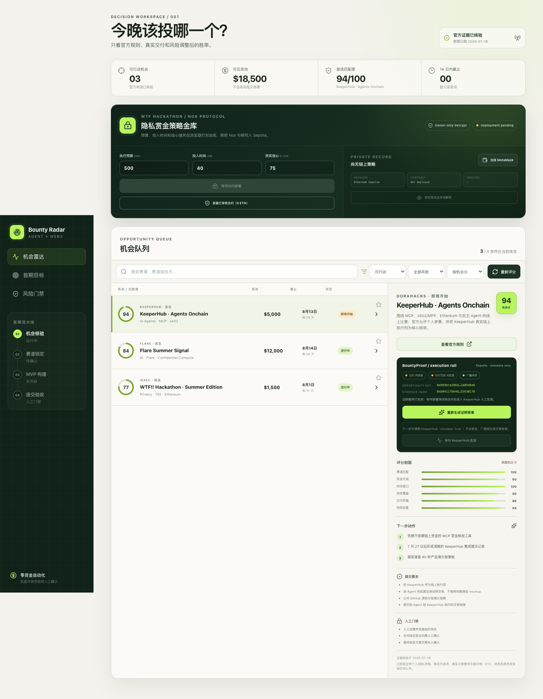

# Bounty Radar / BountyProof Agent

一个面向 AI Agent × Web3 赏金的决策与可验证执行工作台。它把官方活动证据、机会评分、风险门禁和链上证明草案放在同一条流水线中。

- Live dApp: <https://bounty-radar-pandaer119s-projects.vercel.app>
- Public GitHub: <https://github.com/pandaer119/bounty-radar>



## 当前能力

- 官方机会库：记录核验日期、奖池、截止日期、资格、提交物与人工门禁。
- 风险调整评分：综合赛道匹配、奖金可信度、时间窗口、获奖覆盖与交付把握。
- BountyProof：把机会 ID、官方来源和评分生成确定性 `bytes32` 证据载荷。
- Nox 隐私策略金库：在浏览器加密预算、投入时间与获奖信心，Sepolia 只保存不可读句柄；所有者签名后本地解密。
- 链上注册表：`OpportunityRegistry` 支持授权 KeeperHub 执行者与可追溯的证据修订链。
- KeeperHub 安全模拟：服务端适配官方 Direct Execution API，强制 `simulate: true`，拒绝任何带交易哈希的异常响应。
- 安全默认值：模拟总开关默认关闭；不连接钱包、不签名、不广播交易、不接触真实资金。
- 人工部署门禁：Nox 合约与策略写入都由 MetaMask 显示网络、gas 和调用内容后确认，应用不接触私钥。

## 本地运行

```bash
npm install
npm run dev
```

访问 `http://localhost:3000`。

## 验证

```bash
npm run typecheck
npm run lint
npm test
npm run test:e2e
npm run build
```

`test:e2e` 使用本机 Chrome 实际完成机会读取、BountyProof 草案、响应式布局、API 状态、基础可访问性与高风险阻断验收。桌面、平板和手机截图保存在 `docs/evidence/screenshots/`。

## Nox / WTF Hackathon

当前 WTF 参赛功能位于页面顶部的“隐私赏金策略金库”。未部署时，保存按钮安全禁用；点击“部署已审核合约（0 ETH）”只会发起 Ethereum Sepolia 合约部署，并由 MetaMask 最终确认。部署完成后：

1. 输入预算、投入时间和信心值。
2. 点击“加密并保存到 Sepolia”，确认测试网交易。
3. 链上只显示 Nox 句柄；点击“钱包签名后本地解密”查看明文。

部署后可把公开地址写入 `NEXT_PUBLIC_NOX_STRATEGY_VAULT_ADDRESS`。SDK、ACL、编码方式和安全边界见 [Confidential Strategy Vault 架构](docs/architecture/confidential-strategy-vault.md)，比赛交付清单见 [WTF Nox 2026](docs/competition/wtf-nox-2026.md)。

### Sepolia 实证

- 合约：[ConfidentialStrategyVault](https://sepolia.etherscan.io/address/0xB766Ca2571645b19b7DA65fb1774DB87F4eE4B37)
- 部署交易：[0x7661…8c96](https://sepolia.etherscan.io/tx/0x7661ee2c528676042608b391ed606802a21e4b2ae898d362d4abcd41abcd8c96)
- 首次加密策略写入：[0xc6d6…3fcd](https://sepolia.etherscan.io/tx/0xc6d6a8e3c7278d6401b11da1ba3289c16f299d8909d690a2653ce24e3b3a3fcd)

两笔交易均已在 Ethereum Sepolia 确认成功；公开读取只返回 Nox 加密句柄与更新时间，不公开策略明文。

## KeeperHub 离线交接

```bash
npm run keeperhub:preflight
npm run keeperhub:handoff -- --opportunity-id keeperhub-agents-onchain-2026
```

两条命令默认只做离线检查和 handoff 生成，不联网、不签名、不创建交易。待人工完成 Sepolia 部署和 KeeperHub 组织配置后，在本机服务端环境配置 `OPPORTUNITY_REGISTRY_ADDRESS`、`KEEPERHUB_API_KEY`，并明确将 `KEEPERHUB_SIMULATION_ENABLED=true` 才能调用非广播模拟。不要在聊天、前端或仓库中粘贴密钥。

## 比赛路线

首选 [KeeperHub · Agents Onchain](https://dorahacks.io/hackathon/agents-onchain/detail)。比赛要求 Agent 通过 KeeperHub 完成真实链上交易，因此当前实现先完成可验证载荷、合约和安全执行边界；正式测试网部署与 KeeperHub 写操作必须在人工批准后进行。

当前已报名并完成公开 MVP 的是 [WTF!! Hackathon · Summer Edition](https://dorahacks.io/hackathon/wtf-hackathon/detail)，其 Nox 功能、测试、Sepolia 闭环和公开部署均已验收。

WTF Nox 参赛版本已完成真实 Sepolia 部署、加密写入、owner-only 本地解密与公开 dApp 上线；剩余交付为演示视频、X 帖子和 DoraHacks 最终提交。

项目设计、比赛规则与路线图见 [docs/INDEX.md](docs/INDEX.md)。
